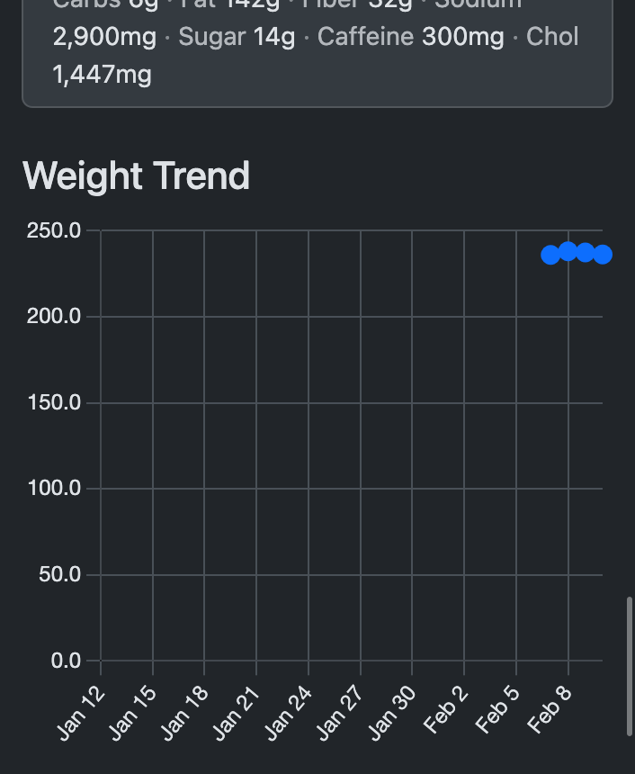
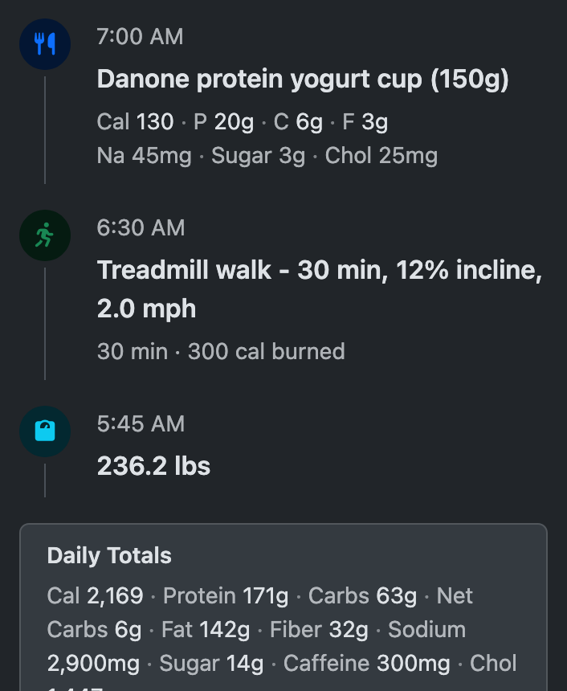
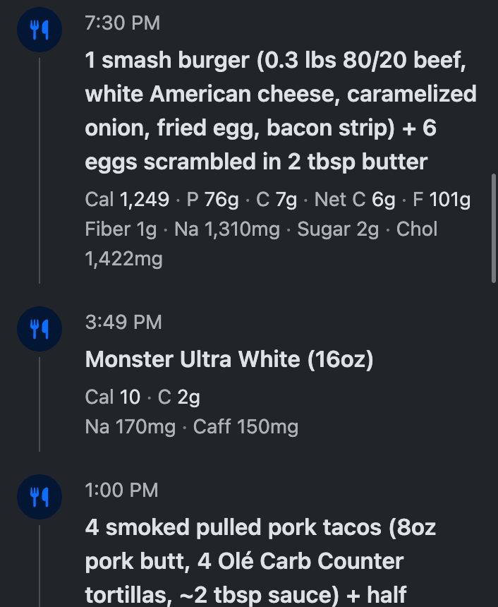
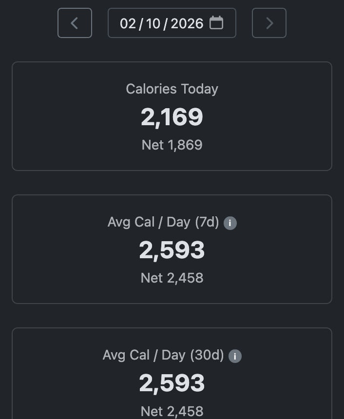

# JustLog

A calorie, macro, and weight tracking service designed to be used through AI assistants. There is no app UI for data entry. You tell your AI what you ate, what exercise you did, or what you weigh, and it handles the rest.

The core idea: the MCP server is the product. Claude, ChatGPT, or any MCP-compatible client acts as the interface. The AI estimates calories and macros from natural language, and JustLog stores the numbers.

| | | | |
|:---:|:---:|:---:|:---:|
|  |  |  |  |

## How It Works

Connect the JustLog MCP server to your AI assistant. Then just talk to it normally:

- "I had a Publix three-tender meal with the roll, wedges and onion rings for the sides"
- "Did 30 minutes on the treadmill, 12% incline at 2.5 mph"
- "Weighed in at 236 this morning"

The AI figures out the nutritional breakdown, calorie burn, or weight entry and logs it through the MCP server. When you want to see your data, just ask — daily totals, weekly averages, trends, whatever you need.

## What Gets Tracked

**Food** — calories, protein, carbs, fat, fiber, and a text description of what you ate.

**Exercise** — estimated calories burned and a text description of the activity.

**Weight** — body weight in pounds.

That's it. No barcode scanning, no food database searches, no manual data entry forms. The AI does the estimation work, the server stores numbers.

## Stack

- **Frontend**: Hugo + Bootstrap 5.3 (SCSS via Dart Sass) + TypeScript (esbuild)
- **API**: Pure Go HTTP server, deployed to AWS Lambda behind API Gateway
- **MCP Server**: Go, `mark3labs/mcp-go`, Streamable HTTP transport, deployed to Lambda
- **Database**: DynamoDB
- **Auth**: AWS Cognito (email/password and Google sign-in)
- **Hosting**: S3 + CloudFront with KVS-based blue-green deploys

## Project Structure

```
site/          Hugo frontend (layouts, SCSS, TypeScript, content)
go/api/        Minimal HTTP handler library (context-based, no frameworks)
go/cmd/        CLI tools (esbuild compiler, hugo dev server, deploy)
go/lambda/api/ REST API (Lambda + API Gateway)
go/lambda/mcp/ MCP server (Lambda)
go/dynamo/     DynamoDB helpers
aws/           CloudFront Functions
```

See `AGENTS.md` for the full development guide.

## Prerequisites

- Go 1.22+
- Hugo (extended edition)
- Dart Sass
- Node.js + pnpm
- AWS CLI (configured)

## Development

```bash
# Install frontend dependencies
cd site && pnpm install && cd ..

# Start dev server (esbuild watch + Hugo server)
go run ./go/cmd/hugo-server

# Run API locally (port 8090)
go run ./go/lambda/api

# Run MCP server locally (port 8088)
go run ./go/lambda/mcp
```

## Deploy

```bash
# Deploy Hugo site to S3 + CloudFront
go run ./go/cmd/deploy-site

# Deploy API Lambda
cd go/lambda/api && node deploy.js

# Deploy MCP Lambda
cd go/lambda/mcp && node deploy.js
```

## Authentication

Users create an account through AWS Cognito with email/password or Google sign-in. The MCP server and API require a valid bearer token for all operations. Each user's data is isolated.

## MCP Server

The server implements the MCP 2025-06-18 specification using Streamable HTTP transport. It exposes tools for logging food, exercise, and weight, plus querying historical data. See `AGENTS.md` for detailed guidance on how AI agents should interact with the server.

## License

MIT
